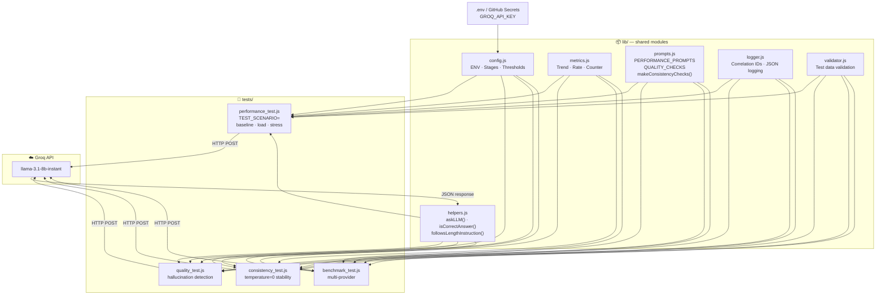

# LLM Performance & Quality Testing Framework

A comprehensive testing framework for evaluating LLM API performance, 
reliability, and response quality under various load conditions.

## 🎯 What This Project Tests

- **Performance** — How fast does the LLM respond under load?
- **Reliability** — At what point does the system start failing?
- **Quality** — Are the responses accurate and consistent?
- **Hallucination Detection** — Does the model give wrong answers?

## Architecture

The framework follows a **SOLID/DRY** modular design — all shared logic lives in `lib/`,
tests only import what they need.



| Module | Responsibility |
|--------|---------------|
| `lib/config.js` | ENV variables, test stage profiles, thresholds |
| `lib/metrics.js` | All k6 custom metrics (single source — no duplicates) |
| `lib/helpers.js` | `askLLM()` HTTP wrapper, answer evaluation functions |
| `lib/prompts.js` | All test prompts and expected answers |
| `lib/logger.js` | Structured JSON logging with correlation IDs |
| `lib/validator.js` | Test data validation at startup |
| `lib/providers.js` | Multi-provider support (Groq, Ollama) |
| `tests/performance_test.js` | Baseline / Load / Stress via `TEST_SCENARIO` env var |
| `tests/quality_test.js` | Hallucination detection, instruction-following |
| `tests/consistency_test.js` | Response stability at `temperature=0` |
| `tests/benchmark_test.js` | Multi-provider comparison |

## 🛠️ Tech Stack

- **k6** — Load testing framework
- **Groq API** — LLM provider (llama-3.1-8b-instant)
- **Vitest** — Unit testing for helper functions
- **JavaScript** — Test scripting

## Testing Features

### Structured Logging
All logs are JSON-formatted for easy dashboard parsing:
```json
{"level":"INFO","timestamp":"2026-03-13T15:30:00.000Z","testRunId":"abc-123","component":"helpers","message":"LLM request started","correlationId":"req-456"}
```

### Correlation IDs
Every LLM request gets a unique correlation ID for tracing:
- Request/response pairs can be traced through logs
- Failures can be correlated with specific requests

### Test Data Validation
All test data is validated at startup:
- Missing required fields
- Invalid prompt formats
- Empty test cases
- Configuration issues

### Unit Tests
Run unit tests for helper functions:
```bash
npm test
```

## 📊 Key Findings

| Test | Max Users | Success Rate | p95 Latency |
|------|-----------|--------------|-------------|
| Baseline | 5 | 100% | 139ms |
| Load | 20 | 100% | 125ms |
| Stress | 100% | 95% | 3s |

> ⚠️ Rate limiting begins at ~5 simultaneous users on Groq free tier.
> LLM response quality remains 100% when API responds successfully.

## 🧪 Test Suite

### 1. Baseline Test
Tests normal operating conditions with up to 5 virtual users.
- ✅ Establishes performance benchmarks
- ✅ Validates API connectivity and response format

### 2. Load Test
Simulates realistic load with up to 20 virtual users.
- ✅ Identifies performance degradation under load
- ✅ Measures latency distribution (p90, p95)

### 3. Stress Test
Pushes the system to its limits with up to 60 virtual users.
- ✅ Identifies breaking point
- ✅ Measures behavior under extreme load

### 4. Quality Test
Validates accuracy and detects hallucinations.
- ✅ Tests factual accuracy (capitals, math)
- ✅ Detects when model ignores instructions
- ✅ Supports multiple valid answers per question

### 5. Consistency Test
Verifies model gives consistent answers to identical questions.
- ✅ Detects non-deterministic behavior
- ✅ Validates temperature=0 consistency

### 6. Benchmark Test
Compare multiple LLM providers.
- ✅ Groq vs Ollama comparison
- ✅ Quality and latency comparison

## 🚀 How To Run

### Prerequisites
- k6 installed (`brew install k6`)
- Groq API key ([get one free](https://console.groq.com))

### Setup
```bash
git clone https://github.com/AnaTodorov86/llm-performance-testing.git
cd llm-performance-testing
npm install
cp .env.example .env
# Add your GROQ_API_KEY to .env
```

### Run Unit Tests
```bash
npm test
```

### Run Individual Tests
```bash
# Performance tests (baseline/load/stress)
k6 run --env GROQ_API_KEY=$GROQ_API_KEY tests/performance_test.js
k6 run --env GROQ_API_KEY=$GROQ_API_KEY --env TEST_SCENARIO=load tests/performance_test.js
k6 run --env GROQ_API_KEY=$GROQ_API_KEY --env TEST_SCENARIO=stress tests/performance_test.js

# Quality test
k6 run --env GROQ_API_KEY=$GROQ_API_KEY tests/quality_test.js

# Consistency test
k6 run --env GROQ_API_KEY=$GROQ_API_KEY tests/consistency_test.js

# Benchmark test (multi-provider)
k6 run --env GROQ_API_KEY=$GROQ_API_KEY --env PROVIDER=groq tests/benchmark_test.js
k6 run --env PROVIDER=ollama tests/benchmark_test.js
```

## 📁 Project Structure
```
llm-performance-testing/
├── lib/
│   ├── config.js              # ENV variables, stages, thresholds
│   ├── metrics.js             # k6 custom metrics
│   ├── helpers.js             # askLLM(), answer validation
│   ├── prompts.js             # Test prompts and test cases
│   ├── logger.js              # Structured JSON logging
│   ├── validator.js           # Test data validation
│   ├── providers.js           # Multi-provider abstraction
│   └── analyzer.js            # Self-healing failure analysis
├── tests/
│   ├── unit/
│   │   └── helpers.test.js   # Unit tests for helper functions
│   ├── performance_test.js    # Baseline/Load/Stress scenarios
│   ├── quality_test.js        # Hallucination detection
│   ├── consistency_test.js    # Response consistency
│   └── benchmark_test.js      # Multi-provider comparison
├── scripts/
│   └── run_all_tests.sh      # runs all tests
├── package.json               # npm dependencies
├── .env.example               # environment variables template
├── .gitignore
└── README.md
```

## 💡 Key Insights

1. **Groq free tier** supports ~5 simultaneous users before rate limiting
2. **LLM quality** remains perfect (100%) when API responds
3. **Latency** is excellent — avg ~92ms, p95 ~139ms
4. **Consistency** is perfect with temperature=0
5. **Hallucination risk** exists for questions with multiple valid answers

## Results

See [BENCHMARK_RESULTS.md](./BENCHMARK_RESULTS.md) for full provider comparison and key findings.
